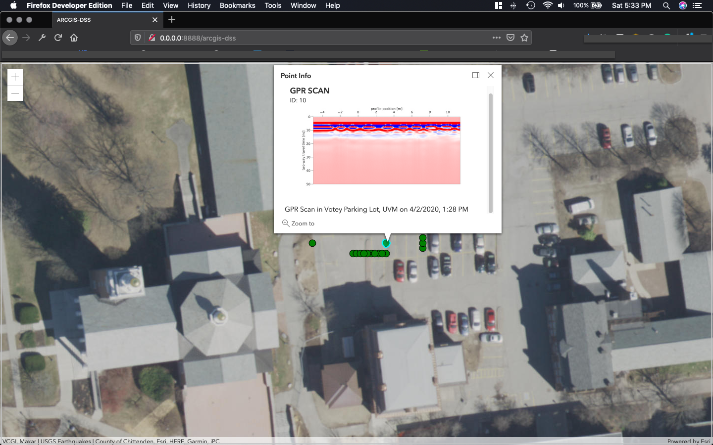

# Usage

Make sure you have installed Python 3.7+ on your machine. 

1. Clone or download repository from GitHub.
2. Navigate to root directory of this repository: ```arcgis-dss/```
3. Install requirements with ```pip install -r requirements.txt```
(keep in mind, on Windows using Git Bash is ideal way to utilize pip.)
4. Open web browser and navigate to localhost:8888/arcgis-dss

You should see this:


